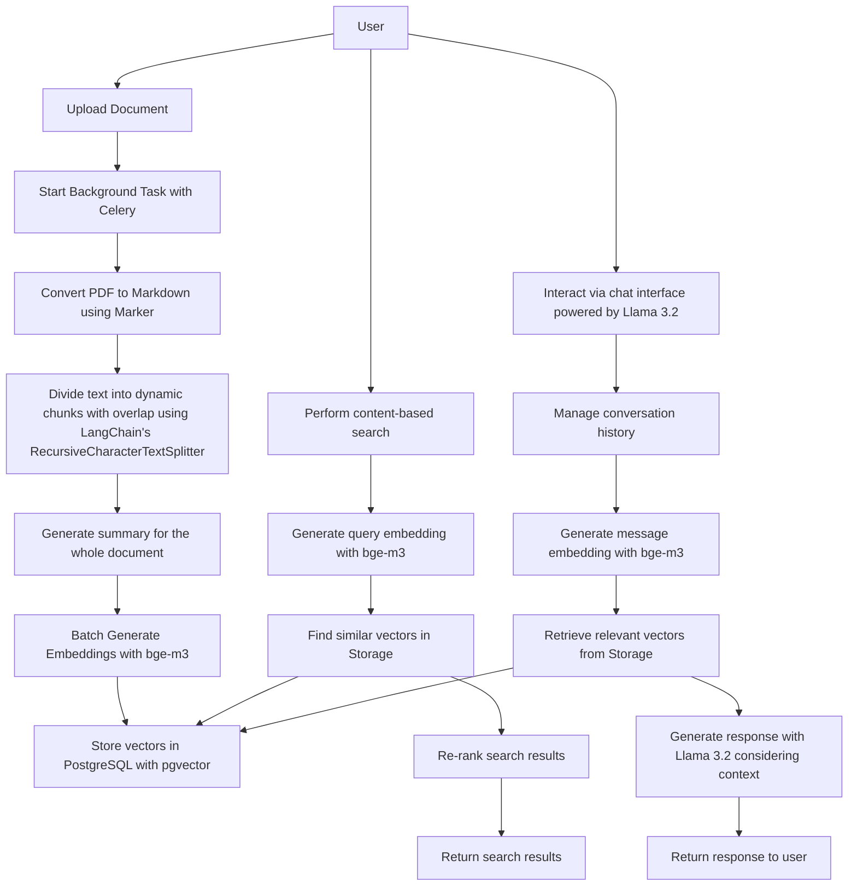

# IntelDocs Backend

The IntelDocs Backend is a comprehensive system designed to process, analyze, and facilitate interactive searching and chatting with documents, including scanned PDFs and non-searchable text files.

## Table of Contents

- [Features](#features)
- [Prerequisites](#prerequisites)
- [Installation](#installation)
- [Configuration](#configuration)
- [Running the Application](#running-the-application)
- [How It Works](#how-it-works)
- [Use Case](#use-case)

## Features

- **Content-Based Search**: Search through the actual content of documents, not just titles or keywords, enabling deeper and more relevant queries.
- **OCR Processing**: Automatically extract text from scanned PDFs using Optical Character Recognition (OCR) for enhanced accessibility.
- **Dynamic Chunking**: Divide text into dynamic, overlapping chunks to retain contextual integrity during processing.
- **Batch Embedding Generation**: Generate embeddings in batches using the bge-m3 model, ensuring efficient vector computation for large datasets.
- **Vector Storage with pgvector**: Store and retrieve vector embeddings efficiently using PostgreSQL with the pgvector extension.
- **Interactive Chat Interface**: Engage with the document collection through a chat interface powered by Llama 3.2, supporting contextual conversations.
- **Enhanced Search Workflow**: Incorporate query embeddings, similarity search, and result re-ranking to provide highly relevant search results.
- **Context-Aware Chat Responses**: Retrieve relevant context vectors for user messages and generate informed responses using Llama 3.2.

## Prerequisites

- Docker and Docker Compose

## Installation

### 1. Clone the Repository

```bash
git clone https://github.com/mjcarnaje/inteldocs.git
cd inteldocs
```

### 2. Pull Required Models

Pull the Llama 3.2 and bge-m3 models using Ollama:

```bash
ollama pull llama2:3.2
ollama pull bge-m3
```

Ensure that the `ollama` service in the `docker-compose.yml` is correctly configured to access the models.

### 3. Build and Start the Containers

```bash
docker-compose up --build
```

## Configuration

Ensure that all services (Redis, PostgreSQL, and Ollama) are running and properly configured. Update any necessary settings directly in your `docker-compose.yml` file or the application code.

## Running the Application

### Using Docker Compose (Recommended)

Start all services using Docker Compose:

```bash
docker-compose up
```

## How It Works



## Use Case

The system is ideal for environments with extensive document collections requiring efficient search and interaction capabilities. For example, a professor can:

- Upload all academic materials, including scanned documents.
- Search for specific events like "Palakasan 2023" and retrieve all related documents based on content.
- Engage in a conversational interface to ask follow-up questions or seek clarifications, much like interacting with ChatGPT.
