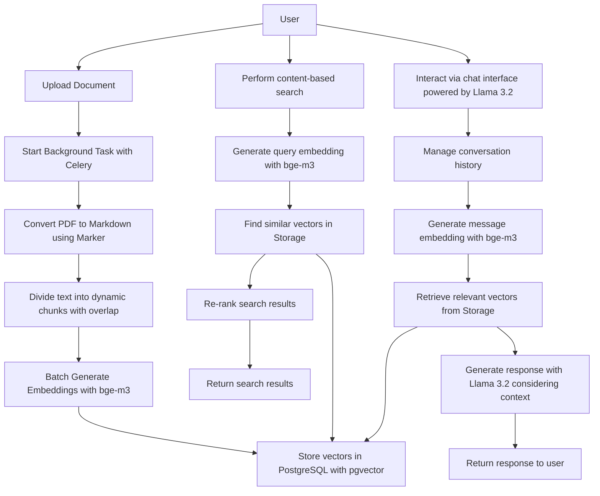

# IntelDocs Backend

The IntelDocs Backend is a comprehensive system designed to process, analyze, and facilitate interactive searching and chatting with documents, including scanned PDFs and non-searchable text files.

## Table of Contents

- [Features](#features)
- [Prerequisites](#prerequisites)
- [Installation](#installation)
- [Configuration](#configuration)
- [Running the Application](#running-the-application)
- [How It Works](#how-it-works)
- [Use Case](#use-case)

## Features

- **Content-Based Search**: Search through the actual content of documents, not just titles or keywords.
- **OCR Processing**: Automatically extract text from scanned PDFs using Optical Character Recognition (OCR).
- **Dynamic Chunking**: Divide text into chunks dynamically with overlapping sections to retain context.
- **Vector Embeddings with pgvector**: Utilize Llama Embeddings and store vectors in PostgreSQL with the pgvector extension for efficient vector storage and retrieval.
- **Interactive Chat Interface**: Engage with the document collection using a chat interface powered by Llama LLM, similar to ChatGPT.

## Prerequisites

- Python 3.8 or higher
- Redis
- Ollama
- PostgreSQL with pgvector extension

## Installation

### 1. Clone the Repository

```bash
git clone https://github.com/mjcarnaje/inteldocs.git
cd inteldocs
```

### 2. Install Python Dependencies

Ensure you have Python 3.8+ installed. Then, install the required Python packages:

```bash
pip install -r requirements.txt
```

### 3. Install Redis

- **Ubuntu/Debian**:

  ```bash
  sudo apt-get install redis-server
  ```

- **macOS**:

  ```bash
  brew install redis
  ```

- **Windows**:

  Download and install from [Redis Downloads](https://redis.io/download).

### 4. Install Ollama

Follow the instructions on the [Ollama GitHub page](https://github.com/ollama/ollama) to install Ollama for your operating system.

### 5. Pull the Llama 3.2 Model

```bash
ollama pull llama2:3.2
```

### 6. Install PostgreSQL and pgvector

- **Ubuntu/Debian**:

  ```bash
  sudo apt-get update
  sudo apt-get install postgresql postgresql-contrib
  ```

  Then, install pgvector:

  ```bash
  sudo apt-get install postgresql-PG_VERSION-pgvector
  ```

  Replace `PG_VERSION` with your PostgreSQL version number.

- **macOS**:

  ```bash
  brew install postgresql
  ```

  Then, install pgvector:

  ```bash
  brew install pgvector
  ```

- **Windows**:

  Download and install PostgreSQL from the [official website](https://www.postgresql.org/download/windows/).

  For pgvector, follow the instructions on the [pgvector GitHub page](https://github.com/pgvector/pgvector) to build and install the extension on Windows.

### 7. Set Up Environment Variables

Copy the example environment file and customize it:

```bash
cp .env.example .env
```

Edit the `.env` file to configure your environment variables (e.g., database settings, API keys).

## Configuration

Ensure that all services (Redis, Ollama, PostgreSQL) are running and properly configured. Update the settings in your Django `settings.py` and `.env` files as needed.

## Running the Application

### Using Honcho (Recommended)

Create a `Procfile` in your project root and start all services with a single command:

```bash
honcho start
```

This will start Redis, Django server, and Celery workers simultaneously.

### Alternative: Start Services Individually

#### Start Redis Server

```bash
redis-server
```

#### Apply Database Migrations

```bash
python manage.py migrate
```

#### Run the Django Development Server

```bash
python manage.py runserver
```

#### Start Background Workers

If using Celery for background tasks:

```bash
celery -A inteldocs worker --loglevel=info
```

## How It Works



## Use Case

The system is ideal for environments with extensive document collections requiring efficient search and interaction capabilities. For example, a professor can:

- Upload all academic materials, including scanned documents.
- Search for specific events like "Palakasan 2023" and retrieve all related documents based on content.
- Engage in a conversational interface to ask follow-up questions or seek clarifications, much like interacting with ChatGPT.
